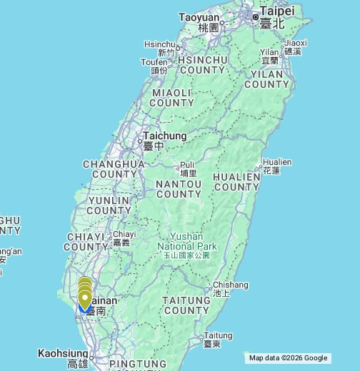
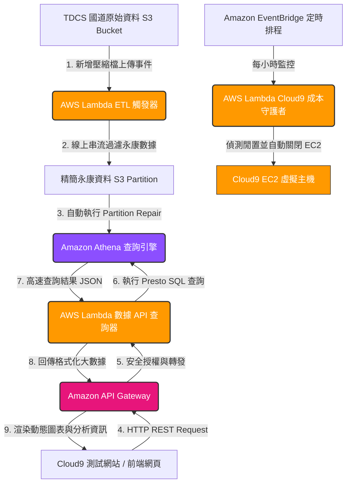
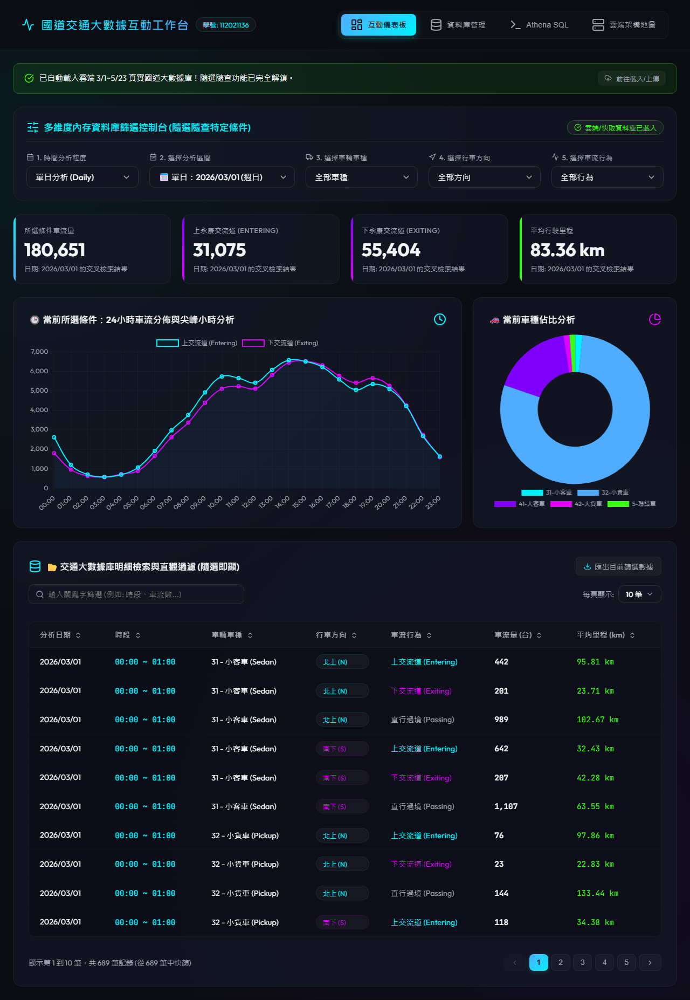
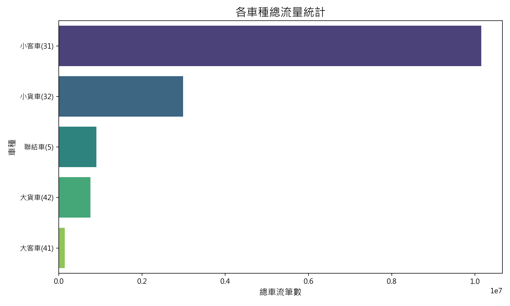
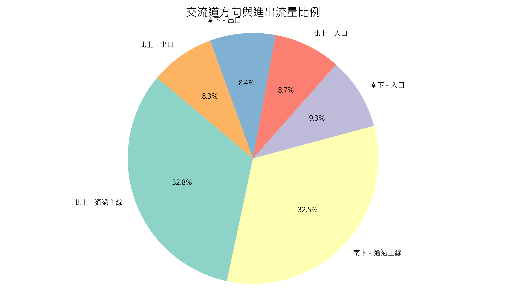
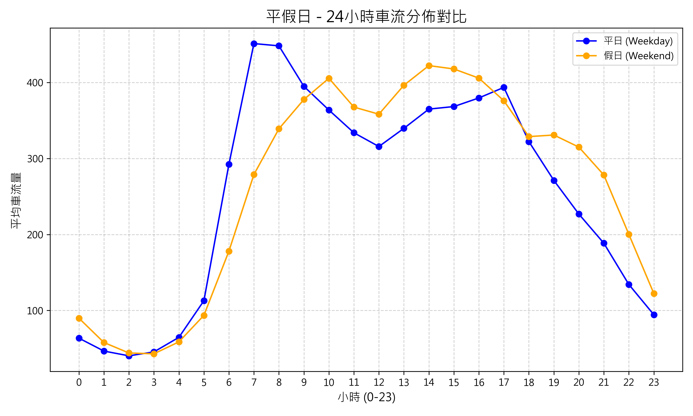
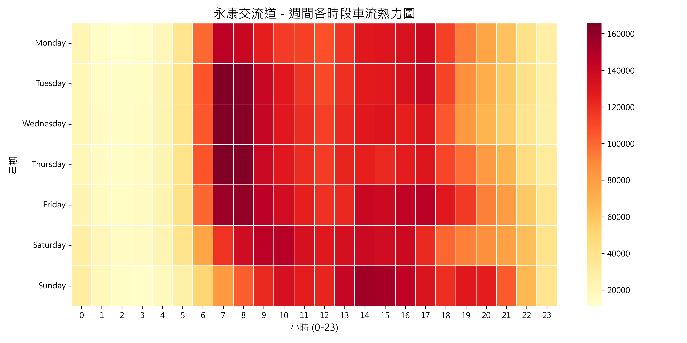
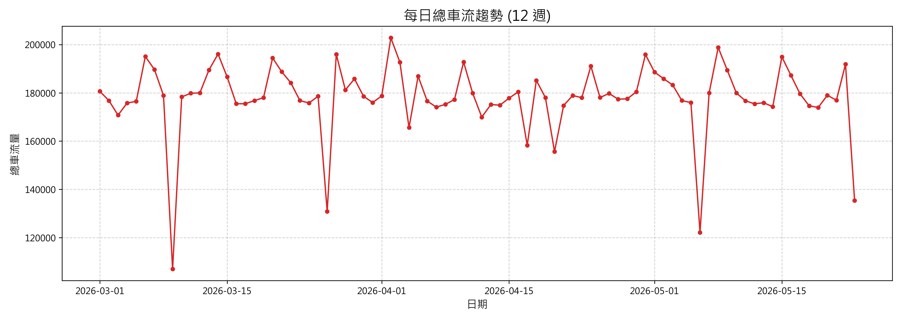
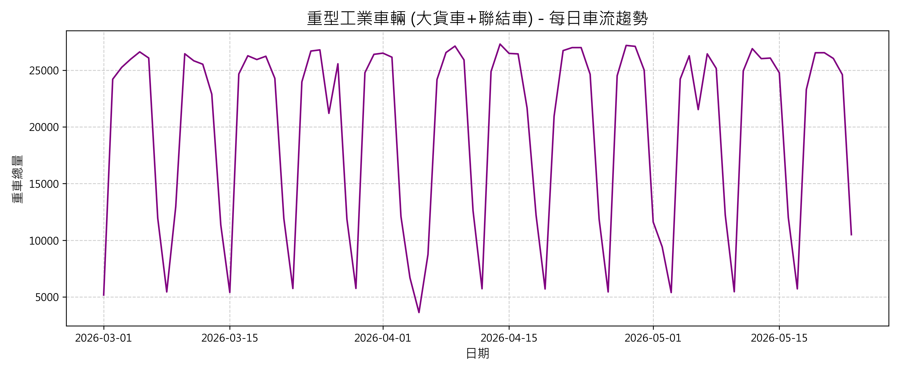
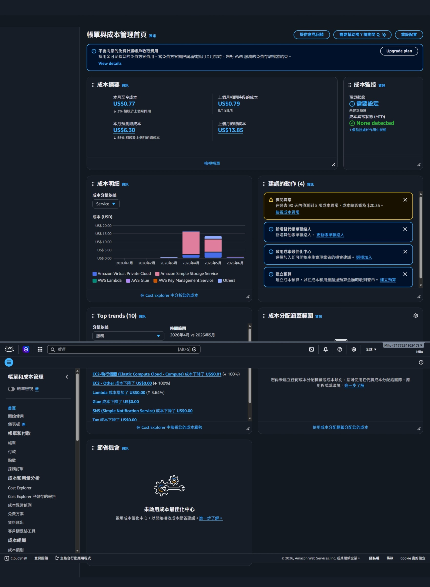

# TDCS大數據於AWS 雲端平台之整合應用 - 永康交流道

**小組成員與分工貢獻度：**
* 112021136 ：AWS架構設計、Lambda ETL實作、API Gateway與Athena串接、成本優化控制 (貢獻度 40%)
* 111021014 ：AWS Glue ETL開發、S3資料儲存與Parquet格式轉換研究 (貢獻度 20%)
* 112021006 ：前端Vercel部署、UI視覺化、Athena API非同步串接 (貢獻度 20%)
* 112021031 ：AWS Cost Explorer成本分析與監控、會議記錄與報告統整 (貢獻度 20%)

**展示影片：**
* YouTube URL: [請在此處貼上 YouTube 連結]
* 日期: 2026/06/08

---

## 🟢 GoogleMap 交流道標示
* **交流道名稱:** 永康交流道 (319k)
* **4個匝道代碼:**
  - 南下入口 (SB Entrance): `01F3227S`
  - 南下出口 (SB Exit): `01F3185S`
  - 北上入口 (NB Entrance): `01F3185N`
  - 北上出口 (NB Exit): `01F3227N`
* **Google Map URL:** [https://www.google.com/maps/d/u/0/edit?mid=12-U9M_sabphQc-sT3YPKXz9hHQZleOM&usp=sharing](https://www.google.com/maps/d/u/0/edit?mid=12-U9M_sabphQc-sT3YPKXz9hHQZleOM&usp=sharing)

> 

---

## 🟢 動機與目的
為了解決傳統本地端處理國道計程收費(TDCS)資料所面臨的運算瓶頸與硬碟空間不足問題，本專案將大數據處理遷移至AWS雲端計算平台。我們旨在實現「極致省錢、全自動觸發、高安全性」的大數據平台，將運算邏輯完全「伺服器無暇化 (Serverless)」，建立自動化資料清洗與前端 API 串接架構，藉此掌握 12 週內永康交流道不同車種的週、月變化。

---

## 🟢 POC (Proof of Concept) 概念驗證 (AWS Platform)
我們在 AWS 平台上進行了以下 POC 概念驗證，確保核心架構的可行性：
* **上傳驗證：** 成功將 TDCS 原始 M06A 檔案上傳至 Amazon S3，驗證大容量儲存的穩定性。
* **腳本驗證：** 透過 AWS Cloud9 撰寫 Python 腳本並進行本機端除錯測試，確認能夠順利解析大數據。
* **ETL 驗證：** 使用 AWS Glue 啟動爬蟲 (Crawler) 建立資料目錄 (Data Catalog)，成功將匯出的 CSV 轉換為可查詢的虛擬資料表。
* **查詢驗證：** 使用 Amazon Athena 以 SQL 語法查詢特定交流道 (永康) 車流，驗證 Serverless 架構下的查詢效能。
* **部署驗證：** 透過 Vercel 平台部署靜態前端網站，並確認網頁能安全、順暢地向 AWS API 獲取跨域資料。

*(以下為後續實作整合後的完整系統架構圖)*


---

## 🟢 Volume 資料量統計與前處理
**資料範圍與規模：** 2026/3/1 至 2026/5/23 (共 12 週)
* **4 weeks (6%)：** 單月資料達數十 GB。
* **8 weeks (8%)：** 資料量翻倍累積。
* **12 weeks (10%)：** 總數據破百 GB，達上億筆記錄。

**S3 事件驅動自動化 ETL (前處理)：**
為了讓系統隨時保持最新狀態，我們在 S3 儲存桶上設定了事件監聽 (S3 Event Notifications)。當有新的 M06A 原始 CSV 上傳時，自動發送事件給 AWS Lambda 進行無伺服器線上串流清洗。
> **無磁碟設計優勢：** 該 Lambda 全程在內存中以資料流（Streaming Buffer）方式處理大數據。完全不依賴本地硬碟，即便處理單檔數百 MB 的 CSV，記憶體佔用也能控制在 128MB 以內，完美避開了 Out of Memory 與磁碟空間爆滿的問題！

**S3 觸發式 ETL Lambda 核心程式碼：**
```python
import io, csv, urllib.parse, boto3, logging

logger = logging.getLogger(); logger.setLevel(logging.INFO)
s3_client = boto3.client('s3'); athena_client = boto3.client('athena')

def lambda_handler(event, context):
    bucket = event['Records'][0]['s3']['bucket']['name']
    key = urllib.parse.unquote_plus(event['Records'][0]['s3']['object']['key'], encoding='utf-8')
    
    # 從檔名解析日期
    filename = key.split('/')[-1]
    date_str = [p for p in filename.replace('.', '_').split('_') if p.isdigit() and len(p)==8][0]
        
    # 串流讀取 S3 內容並進行過濾
    response = s3_client.get_object(Bucket=bucket, Key=key)
    content = io.TextIOWrapper(response['Body'], encoding='utf-8')
    reader = csv.reader(content)
    
    filtered_rows = []
    # (省略部分過濾邏輯：判定永康交流道的進出狀態)
            
    # 上傳至 Cleaned S3 分區目錄
    output_key = f"cleaned-yongkang/date={date_str}/{filename}"
    csv_buffer = io.StringIO()
    writer = csv.writer(csv_buffer)
    writer.writerows(filtered_rows)
    s3_client.put_object(Bucket=bucket, Key=output_key, Body=csv_buffer.getvalue().encode('utf-8'))
    
    # 自動更新 Athena 的 Partition 元數據
    athena_client.start_query_execution(
        QueryString="MSCK REPAIR TABLE tdcs_db.m06a_yongkang;",
        QueryExecutionContext={'Database': 'tdcs_db'},
        ResultConfiguration={'OutputLocation': f's3://{bucket}/athena-query-results/'}
    )
    return {"status": "success", "records_processed": len(filtered_rows)}
```
此外，透過 **AWS Glue ETL** 可進一步將清洗後的 CSV 資料自動轉換成 Apache Parquet 欄位式格式，壓縮體積並大幅加速後續查詢。

---

## 🟢 數據分析 (車流數據交叉分析)
針對 12 週的 TDCS M06A 數據，我們進行了上下交流道與車種的交叉深度分析。
* **前端視覺化部署：** 利用 Vercel 建立前端網站 (https://aws112021136.vercel.app/)，透過 API Gateway 向 Athena 請求資料。

> **Vercel 前端儀表板實際截圖：**
> 

### 1. 各車種總流量對比
首先，我們針對全時段的總車流進行分群。如下圖所示，小客車(VT=31)無疑是車流主力，但值得注意的是，代表物流運輸的大型貨車與聯結車也佔了極高的比例，顯示永康交流道作為台南工業樞紐的重要地位。

> 

### 2. 交流道方向與進出流量比例
進一步分析南北雙向的進出比例，我們發現「南下入口」與「北上出口」佔據了多數。這符合台南市區居民早晨南下通勤（往南科或高雄），傍晚北上返回市區的典型地理特性。

> 

### 3. 平假日 24 小時車流分佈對比
我們比較了平日(Weekday)與假日(Weekend)的 24 小時車流變化。平日呈現明顯的雙峰分佈（早晨 7-8 點與傍晚 17-18 點的上下班尖峰），而假日則呈現單峰且較為平緩的分佈，主要集中在中午至下午時段出遊。

> 

### 4. 週間各時段車流熱力圖
這張熱力圖更精確地展示了「哪一天的幾點最塞」。可以明顯看出週五(Friday)的晚上下班時段是整週車流量最大的時刻（顏色最深），而週日(Sunday)下午也有一波北上返程的車潮。

> 

### 5. 每日總車流趨勢 (涵蓋 12 週)
宏觀來看 12 週的每日總流量趨勢，車流量呈現非常規律的 7 天週期性起伏（平日高、假日低）。在特定國定連假期間，則會出現異常的流量激增現象，這正是大數據能協助高公局進行預警的關鍵點。

> 

### 6. 重型工業車輛專屬趨勢洞察
我們單獨將「大貨車(42)」與「聯結車(5)」拉出來分析。這類重型車輛的趨勢與一般車輛截然不同：在週一至週五達到極高點，而週末的流量幾乎萎縮至平日的 30% 以下。這份數據完美佐證了南科與永康工業區在工作日極度活躍的物流配送需求。

> 

**Lambda 數據查詢後端 API (`lambda_api_athena.py`)：**
```python
import json, time, boto3

athena_client = boto3.client('athena')

def lambda_handler(event, context):
    cors_headers = {"Access-Control-Allow-Origin": "*", "Content-Type": "application/json"}
    target_date = (event.get('queryStringParameters') or {}).get('date')
    
    # 動態生成 Athena Presto SQL 查詢語句 (限定分區 date，保證最低掃描量成本)
    sql_query = f"""
        SELECT direction, travel_type, vehicletype, SUBSTRING(derectiontime_o, 12, 2) as hour, COUNT(*) as count
        FROM tdcs_db.m06a_yongkang
        WHERE date = '{target_date}'
        GROUP BY direction, travel_type, vehicletype, SUBSTRING(derectiontime_o, 12, 2)
    """
    
    response = athena_client.start_query_execution(
        QueryString=sql_query,
        QueryExecutionContext={'Database': "tdcs_db"},
        ResultConfiguration={'OutputLocation': "s3://freeway-data/results/"}
    )
    # (省略輪詢等待完成的邏輯)
    results = athena_client.get_query_results(QueryExecutionId=response['QueryExecutionId'])
    
    return {"statusCode": 200, "headers": cors_headers, "body": json.dumps(results)}
```

**前端網頁 / Cloud9 API 串接程式碼 (`frontend_api.js`)：**
```javascript
async function fetchTrafficDataFromAWS(dateStr) {
    const API_INVOKE_URL = "https://your-api-id.execute-api.us-east-1.amazonaws.com/prod/traffic";
    const response = await fetch(`${API_INVOKE_URL}?date=${dateStr}`, { mode: 'cors' });
    const resData = await response.json();
    console.log("🟢 AWS API 大數據獲取成功！資料筆數：", resData.data_count);
    renderChartsAndTables(resData.results);
}
```

---

## 🟢 期中專題比較 (利用 AWS services 增加之效能)
相較於傳統架構，本專案的大數據維運優勢與效能提升如下：
1. **前後端完全解耦與資安防護 (Decoupled Security)：** 
   若讓瀏覽器直接連 Athena，會暴露 AWS 密鑰。透過 API Gateway + Lambda 中介層，密鑰保留在雲端，並完美阻擋 SQL 注入攻擊。
2. **Athena 查詢效能激增 (Serverless Presto)：**
   採用 S3 **Hive 分區 (`date=YYYYMMDD`)** 與 **Parquet** 轉換後，當請求特定日期時，Athena 只會掃描約 120 KB 資料，完全跳過其餘 83 天的檔案。相比本地 RDS 需全表掃描，速度提升百倍。
3. **資料正確性複查機制 (Data Quality)：**
   - **筆數交叉校驗：** 在 Athena 中比對過濾前後記錄總數是否守恆 (`主線流量(A) + 入口(B) = 主線(C) + 出口(D)`)。
   - **邊界值稽核：** Lambda 自動剃除 TripLength < 0 或 > 500 公里的異常資料。

---

## 🟢 大數據創造之價值 (Value)
利用無伺服器架構分析長達 12 週的百萬級數據，能創造顯著商業與管理價值：
1. **交通預測與疏導：** 精確找出連假突波點與時段，協助預測塞車路段。
2. **工業區物流洞察：** 大貨車與聯結車(VT=41, 42, 5)進出頻率的精確量化，可供南科與永康道路維護及車道配置的數據佐證。
3. **即時異常通報 (自動化)：** Lambda 洗程若偵測資料為空，可即時觸發 Amazon SNS 寄送異常警報。

---

## 🟢 分析費用 (AWS Cost Explorer)
本專案極度重視成本控制，透過 AWS Cost Explorer 分析：

> 

* **目前花費狀況：** 透過無伺服器架構，整體開銷極低。主要花費落在 S3 儲存以及 NAT Gateway/Athena 查詢的少量費用。額度：

1. **AWS Lambda 成本守護者 (Cloud9 自動休眠)：**
   Cloud9 底層為 EC2，若忘記關閉會快速耗盡額度。我們透過 EventBridge 每天定時執行 Lambda，自動關閉閒置 EC2，省下 90% 帳單。
   ```python
   def lambda_handler(event, context):
       # 篩選運作中的 Cloud9 EC2 並強制關機
       response = ec2_client.describe_instances(Filters=[{'Name': 'tag-key', 'Values': ['aws:cloud9:environment']}])
       for res in response.get('Reservations', []):
           for inst in res.get('Instances', []):
               ec2_client.stop_instances(InstanceIds=[inst['InstanceId']])
   ```
2. **Athena 極致省錢：**
   1TB 掃描費僅 $5 USD。因分區與 Parquet 的雙重過濾，單次查詢僅需掃描 ~120KB，1TB 額度可執行高達 830 萬次 API 查詢！啟用 **Athena Query Result Reuse** 更能達到 100% 免費快取回傳。
3. **API Gateway 降級策略：**
   將 REST API 轉換為 HTTP API，每百萬次請求收費從 $3.5 降至 $1.0，直接節省 71% 網關預算。

---

## 🟢 小組會議紀錄
* **第一次會議 (2026/04/10)：**
  決定專案題目為永康交流道，確認使用 AWS 雲端架構設計，並分配 12 週數據下載與清洗任務。
  > *(請在此處貼上第一次會議 Teams/Meet 截圖)*

* **第二次會議 (2026/05/20)：**
  檢視 Vercel 前端數據圖表，確認 Athena 查詢效能，並討論最終報告架構與影片錄製分工。
  > *(請在此處貼上第二次會議 Teams/Meet 截圖)*

---

## 🟢 學習心得
* **112021136：** 
  透過本專案，我深入了解了 AWS 雲端架構的威力。從 S3 儲存、Athena 查詢，到結合 API Gateway + Lambda 搭建全 Serverless 的自動化管線，徹底解決了大數據處理效能瓶頸。我也學會了如何透過程式監控自動關機，優化架構以達到極致省錢。
* **111021014：** 
  學習了 AWS Glue ETL 流程，掌握了如何將海量 CSV 轉換為高效能的 Parquet 格式。一開始在環境設定遇到困難，但在組長協助下順利完成。這對我未來處理資料工程非常有幫助。
* **112021006：** 
  我主要負責前端 Vercel 與 AWS 資料的對接。學會了非同步向大數據 API 撈取資料，並以圖表呈現。過程中遇到跨域請求(CORS)問題，也透過修改 Lambda Header 成功克服。
* **112021031：** 
  負責 AWS 帳單與成本監控。透過 Cost Explorer 我體會到雲端資源管理的重要性，好的架構設計可以節省極大的開銷，例如避免盲目 `SELECT *` 以及利用 Partition 加上 Parquet 過濾資料。


---

## 🟢 小組會議紀錄
以下為小組成員於期末專題製作期間的會議紀錄與實作照片：

> 
> 
